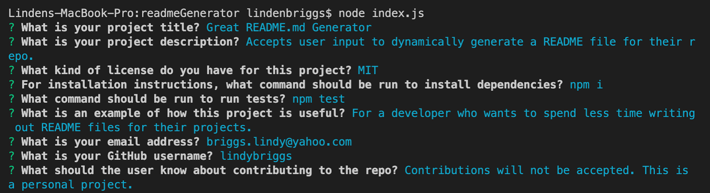

# Professional README Generator

## About

This application uses the command line to dynamically generate a professionald README.md file based on user input.

## Video Walkthrough / Screenshots

See a video walkthrough of this application's use here: 

* [MP4](https://drive.google.com/file/d/1ktezuFYBvOC5wVaVDoc0cUp1pUYZYmcm/view?usp=sharing)
* [MOV](https://drive.google.com/file/d/1mD6pliGwJqrr8HMSOYmeHMMKYr3jNq3e/view?usp=sharing)

## Description

* Application is invoked upon running the following command: node index.js

* 'Require' is used to access the previously installed 'inquirer' module. This allows for a series of prompts to be presented to the user in the command line.

* User enters or chooses the following: project title, description, installation instructions, usage information, contribution guidelines, test instructions, license type, Github account, and email address. 

* Upon completition, user responses are accessed within string interpolation to build content for user's personalized markdown file. In addition to the previously stated sections and components, user's README will also contain a Table of Contents and a generated license notice and badge. 

* An 'fs writeFile' function is called to finally generate this README.md file.

## Features

* JavaScript

* Node.js

* npm/Inquirer

## License

Covered under the [MIT](license.txt) license.